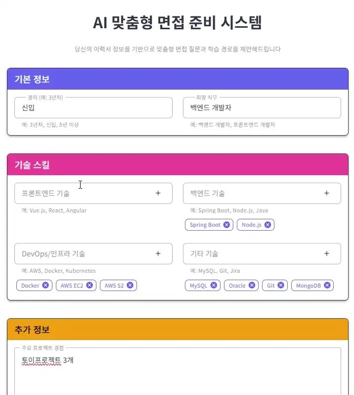
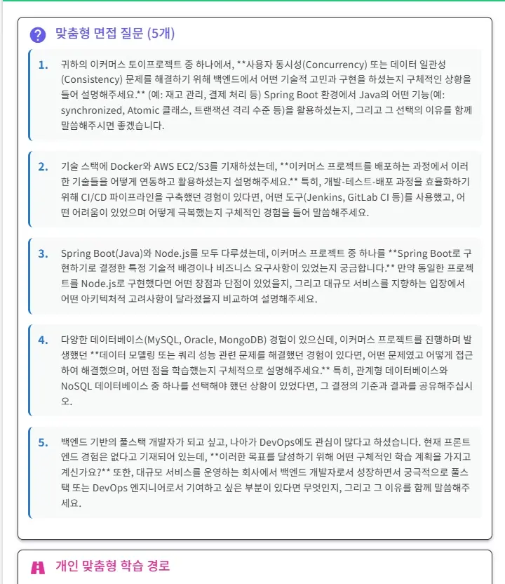

# 🤖 ✅잡코리아 미션! 이력서 기반 개인 맞춤형 커리어 코치 챗봇 API 개발

이 프로젝트는 사용자가 제공한 정보를 바탕으로 Google Gemini 2.5 Flash AI를 활용하여 맞춤형 모의 면접 질문, 자기 개발 제안, 그리고 학습 로드맵을 생성해주는 AI 기반 면접 준비 플랫폼입니다.

## ✨ 주요 기능

- **맞춤형 면접 질문 생성**: 사용자의 경력, 기술, 지원하는 직무에 맞춰진 면접 질문을 제공합니다.
- **자기 개발 제안**: AI가 사용자의 강점과 약점을 분석하여 개인화된 자기 개발 계획을 추천합니다.
- **학습 로드맵 제공**: 목표 달성을 위한 체계적인 학습 경로와 관련 자료를 제안하여 사용자의 성장을 돕습니다.

## 📸 스크린샷

1.  **데이터 입력 (Gemini API 요청)**
    사용자는 자신의 정보와 원하는 분석 유형을 폼에 맞춰 입력하고 제출합니다.

    백엔드 과제지만 심심해서 유저체험 개선을위해 Vue3 Vuetify로 폼제출 쉽게 구현해봤습니다 

    

2.  **AI 분석 결과 (면접 제안 및 로드맵)**
    Gemini 2.5 Flash AI가 데이터를 분석하여 생성한 모의 면접 질문, 자기 개발 제안, 학습 로드맵 결과입니다.
    유저가 작성한 폼에 맞춰서 상당히 길고 상세한 개인 맞춤형 경로, 시간별 로드맵, 조언을 해주고 있습니다.
    필요에따라 프롬프트 엔지니어링으로 더 줄이거나 늘릴 수 있으며 사용하는 AI API의 성능에 따라 그 품질은 달라질 것입니다.

    

## 🛠️ 기술 스택

- **Backend**: Java, Spring Boot
- **Build Tool**: Gradle
- **AI**: Google Gemini Flash 2.5 API
- **API Communication**: WebClient


- **보여지는 FrontEnd**: Vue3, Vuetify, Axios

## 🚀 시작하기

### 사전 요구 사항

- JDK 17 이상
- Gradle

### 설치 및 실행

1.  **프로젝트 클론**
    ```sh
    git clone [저장소 URL]
    cd [프로젝트 디렉토리]
    ```

2.  **프로젝트 빌드**
    ```sh
    # Windows
    .\gradlew.bat build

    # macOS / Linux
    ./gradlew build
    ```

3.  **애플리케이션 실행**
    ```sh
    # Windows
    .\gradlew.bat bootRun

    # macOS / Linux
    ./gradlew bootRun
    ```

## ⚙️ 설정

프로젝트를 실행하기 전에 `src/main/resources/application.properties` 또는 `application.yml` 파일에 Google Gemini API 키를 설정해야 합니다.

```properties
# application.properties 예시
gemini.api.key=YOUR_GEMINI_API_KEY
```

## **참고**: API 키와 같은 민감한 정보는 Git에 커밋하지 마세요. **.gitignore에 반드시 작성!!**


https://juneyoungjung6.shop/


